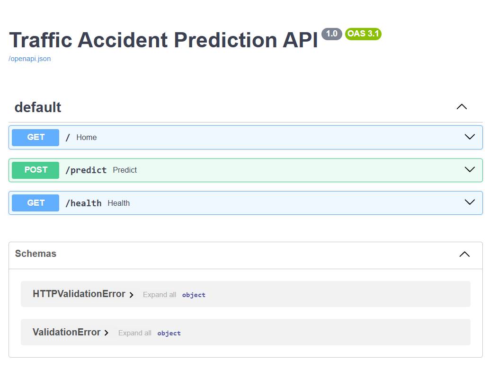
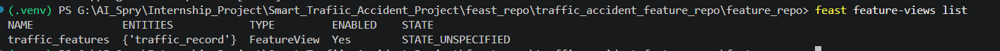
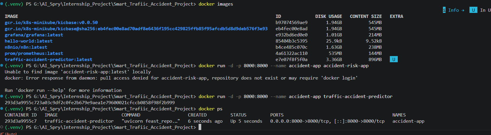

# 🚦 Smart Traffic Accident Prediction System

An end-to-end Machine Learning and MLOps project that predicts the likelihood of traffic accidents using traffic, road, weather, and signal-related features.

## 📌 Project Overview

This project uses historical traffic accident data to build a predictive model that identifies accident-prone situations and locations.

The complete workflow includes:

- Data Cleaning
- Exploratory Data Analysis (EDA)
- Feature Engineering
- Model Training
- Class Imbalance Handling (SMOTE)
- Experiment Tracking with MLflow
- Feature Store using Feast
- FastAPI Deployment
- Docker Containerization

---

## 🏗 Project Architecture

Dataset
↓
Data Cleaning
↓
EDA
↓
Feature Engineering
↓
SMOTE
↓
Random Forest / XGBoost
↓
MLflow Tracking
↓
Feast Feature Store
↓
FastAPI
↓
Docker

---

## 🛠 Tech Stack

### Data Processing
- Python
- Pandas
- NumPy

### Machine Learning
- Scikit-Learn
- XGBoost
- Imbalanced-Learn (SMOTE)

### MLOps
- MLflow
- Feast
- FastAPI
- Docker

### Visualization
- Matplotlib
- Seaborn

---

## 📂 Project Structure

```text
SMART_TRAFFIC_ACCIDENT_PROJECT
│
├── data/
│   └── processed/
│
├── eda_reports/
│
├── feast_repo/
│
├── mlruns/
│
├── models/
│   └── best_model.pkl
│
├── data_cleaning.py
├── EDA.py
├── feature_engineering.py
├── model_training.py
├── mlflow_tracking.py
├── Dockerfile
├── requirements.txt
└── README.md
```

## 📊 Machine Learning Workflow

### Data Cleaning
- Missing value treatment
- Duplicate removal
- Data type correction

### EDA
- Target distribution analysis
- Correlation analysis
- Feature visualization

### Feature Engineering
- Time-based features
- Traffic density
- Speed ratio
- Signal efficiency

### Model Training
Models evaluated:

- Random Forest
- XGBoost

Class imbalance handled using:

- SMOTE

Best model selected automatically based on performance metrics.

---

## 📈 Experiment Tracking

MLflow is used for:

- Parameter tracking
- Metric tracking
- Model versioning

Example Metrics:

- Accuracy
- Precision
- Recall
- F1 Score
- ROC-AUC

---

## 🏪 Feature Store

Feast is used as the Feature Store for:

- Feature management
- Reusable feature definitions
- Consistent training and serving features

---

## 🚀 API Deployment

FastAPI endpoints:

### Health Check

GET

```text
/health
```

Response:

```json
{
  "status": "healthy",
  "model_loaded": true
}
```

### Prediction

POST

```text
/predict
```

---

## 🐳 Docker

Build image:

```bash
docker build -t traffic-accident-predictor .
```

Run container:

```bash
docker run -p 8000:8000 traffic-accident-predictor
```

---

## 🎯 Key Features

- End-to-End Data Science Workflow
- Automated Feature Engineering
- MLflow Experiment Tracking
- Feast Feature Store Integration
- FastAPI REST API
- Dockerized Deployment
- Production-Oriented Architecture

---

## Screenshots

### MLflow Tracking


### FastAPI Swagger



### Feast Feature Store



### Docker Deployment



---

## 👨‍💻 Author

Vignesh Narayanan

Aspiring Data Scientist | AI Specialist | Machine Learning Enthusiast